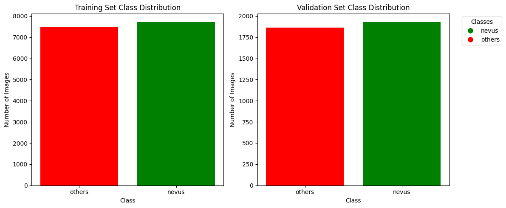
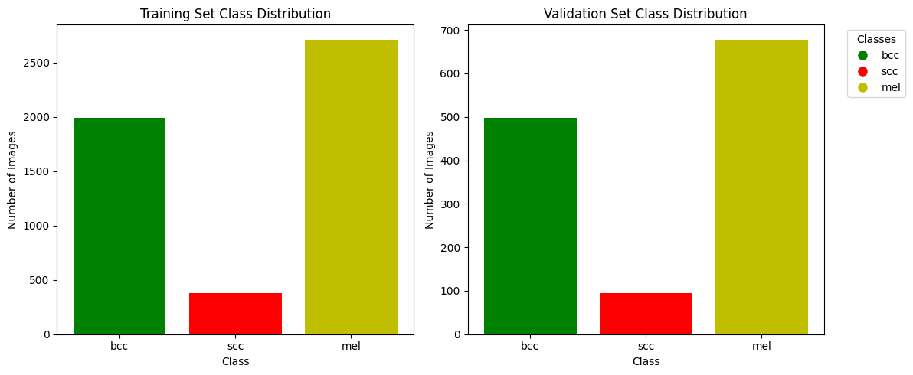

# Deep Skin Lesion Classification
This project is skin classification task to classify skin lesion, which is part of the course project for the Computer Aid Diagnosis course at the University of Girona.

## Table of Contents
1. [Introduction](#introduction)
2. [Dataset](#dataset)
3. [Todos](#todos)
4. [Model](#model)
5. [Results](#results)
6. [References](#references)

## Introduction
Skin cancer is the most common type of cancer, and early detection is crucial for successful treatment. The goal of this project is to develop a machine learning model for 2 challenging tasks: binary classification of benign and malignant skin lesions and three classes classification of Melanoma, Basal Cell Carcinoma, and Squamous Cell Carcinoma.

## Dataset
The dataset includes dermoscopic images in JPEG format with a distribution that reflects real-world settings, where benign cases outnumber malignant ones but with an overrepresentation of malignancies. The images come from:   
- HAM10000 Dataset (ViDIR Group, Medical University of Vienna)
- BCN_20000 Dataset (Hospital Clínic de Barcelona)
- MSK Dataset (ISBI 2017)  

The dataset consists of more than 15,000 images for binary classification and around 6,000 images for three classes classification. Data Distribution of two and three classes classification is shown below:

    Distribution of binary classes in the dataset.

    Distribution of three classes in the dataset.

## Todos
- [x] Data Augmentation
- [x] mlflow monitoring
- [x] Model Training
- [x] Model Evaluation
- [ ] Experiments - Binary Classification
    - [ ] Finetuning
    - [ ] Transfer Learning
    - [ ] ResNet with Attention Mechanism
    - [ ] Finetune Unet for Classification
- [ ] Experiments - Three Classes Classification
- [x] Monitoring
- [x] TTA
- [ ] Ensemble

